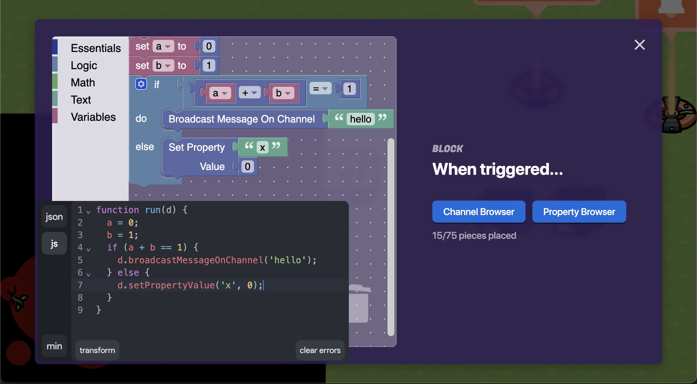

# BlockConverter

A plugin for [Gimloader](https://github.com/TheLazySquid/Gimloader) that converts between JavaScript, JSON and Gimkit Blocks.

## Installation

1. Install [Gimloader](https://github.com/TheLazySquid/Gimloader)
2. [Install the plugin](https://thelazysquid.github.io/gimloader/?installUrl=https://raw.githubusercontent.com/Ashwagandhae/gimkit-block-converter/main/build/BlockConverter.js)
3. (If `Loading script` takes too long, you can also just <a href="https://raw.githubusercontent.com/Ashwagandhae/gimkit-block-converter/main/build/BlockConverter.js" download target="_blank">download the script</a> and install it from the file in Gimloader)

## Usage

BlockConverter appears at bottom-left of the screen when you open a Blocks editor in Gimkit.

BlockConverter has 2 tabs: `json` and `js`.

- `json` allows you to convert JSON to Gimkit Blocks and back
  - Unfortunately, putting disallowed JSON (for loops, more than 75 blocks, etc.) won't work. Although the Blockly workspace will show the blocks, they'll disappear when you exit the editor.
- `js` allows you to convert JavaScript to Gimkit Blocks
  - If the JavaScript conversion fails, the plugin will underline the problematic code and give you an error message.
  - For more details on JavaScript conversion, see [gimblocks](https://github.com/Ashwagandhae/gimblocks)

You can resize the window by dragging the top-right corner, or minimize the window with the button in the bottom-right.
